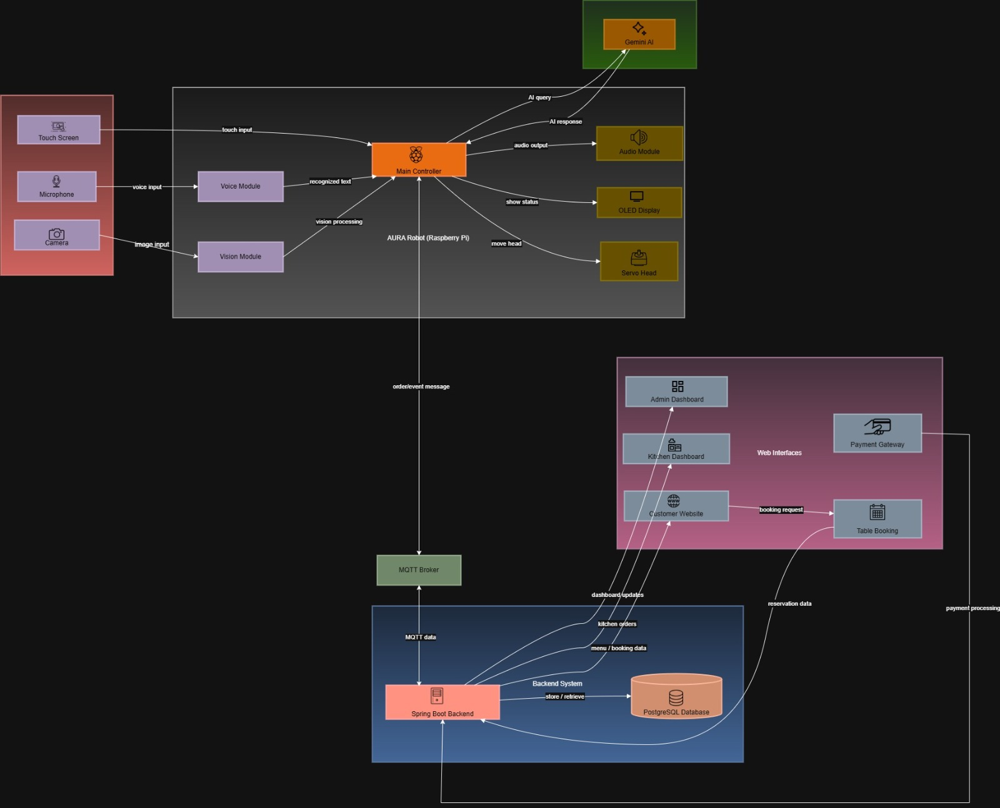

# Project AURA - Automated Urban Restaurant Assistant

  

---

## Team
- **E/21/245** - [MADHUSHAN S.K.A.K.](mailto:e21245@eng.pdn.ac.lk)
- **E/21/113** - [DISSANAYAKE H.G.K.V.D.C.](mailto:e21113@eng.pdn.ac.lk)
- **E/21/024** - [AMARANGA S.G.I.](mailto:e21024@eng.pdn.ac.lk)
- **E/21/407** - [THENNAKOON T.M.I.I.C.](mailto:e21407@eng.pdn.ac.lk)

## Table of Contents
1. [Introduction](#introduction)
2. [Solution Architecture](#solution-architecture)
3. [Hardware & Software Designs](#hardware--software-designs)
4. [Testing](#testing)
5. [Links](#links)

---

## Introduction

In the modern hospitality industry, customers often face delays in ordering, difficulties in communicating with staff due to language barriers, and a lack of engaging entertainment while waiting. **AURA (Automated Urban Restaurant Assistant)** addresses these issues by introducing a smart, interactive table-top robot companion.

Unlike standard digital kiosks, AURA utilizes **Social Robotics** principles—employing active face tracking, voice interaction, and ambient lighting control to create a "living" digital concierge. It streamlines the ordering process, entertains customers, and assists staff by automating repetitive tasks.

### Key Features
* **Interactive Robotics:** Pan & Tilt head movement with face tracking and voice interaction.
* **Autonomous Ordering:** Touch-based ordering system with multi-language support.
* **Smart Environment:** User-controlled ambient RGB lighting (Moods: Dining, Reading, Party).
* **Wireless & Portable:** Battery-powered design requiring no table wiring (Zero Infrastructure Cost).

---

## Solution Architecture

### High-Level Overview
The system consists of three main components:
1. **The AURA Robot Nodes:** Placed at each table, handling user interaction and sensing.
2. **The MQTT Broker:** Managing real-time communication between robots and the server.
3. **The Central Server:** Handling order processing, kitchen display updates, and database management.

---

## Hardware & Software Designs

### Hardware Specifications
The robot is built around high-performance embedded computing to support AI tasks.

| Component | Specification | Purpose |
|-----------|---------------|---------|
| **Main Controller** | Raspberry Pi 4 Model B (4GB) | Core processing, AI, & UI rendering |
| **Display** | 7-inch Capacitive Touch Screen | User Interface for ordering & games |
| **Camera** | Raspberry Pi Camera Module V2 | Face tracking & QR scanning |
| **Actuators** | 2x MG996R Servo Motors | Pan & Tilt mechanism for head movement |
| **Sensors** | PIR Motion Sensor | Presence detection & auto-wake |
| **Power** | Li-ion Battery Pack (10,000mAh) | Portable power source |
| **Audio** | Speaker | interaction & alerts |

### Software Stack
* **Robot Frontend:** Python (PyQt/Kivy) for the touch interface.
* **Robot Logic:** OpenCV for face tracking, GPIO Zero for servo control.
* **Communication:** MQTT Protocol (Paho-MQTT) for lightweight messaging.
* **Central Server:** Flask (Python) web server.
* **Database:** SQLite for managing menu items and transaction history.

### Data Flow
1. **Input:** User interacts via touch or voice. Camera tracks user face.
2. **Processing:** Raspberry Pi processes inputs and generates MQTT payloads.
3. **Transmission:** Data sent over Wi-Fi to the Central Server.
4. **Action:** Kitchen Display shows the order; Robot updates UI/Lighting.

---

## Testing
* **Unit Testing:** Individual testing of Servo mechanisms, Camera feed, and UI components.
* **Integration Testing:** Verifying MQTT message delivery between Robot and Server.
* **User Acceptance Testing (UAT):** Real-world trials in a café environment to assess battery life and user interaction.

---

## Links

- **Project Repository:** [https://github.com/cepdnaclk/eYY-3yp-project-AURA](https://github.com/cepdnaclk/e21-3yp-AURA)
- **Project Page:** [https://cepdnaclk.github.io/eYY-3yp-project-AURA](https://cepdnaclk.github.io/e21-3yp-AURA)
- **Department of Computer Engineering:** [http://www.ce.pdn.ac.lk/](http://www.ce.pdn.ac.lk/)
- **University of Peradeniya:** [https://eng.pdn.ac.lk/](https://eng.pdn.ac.lk/)
